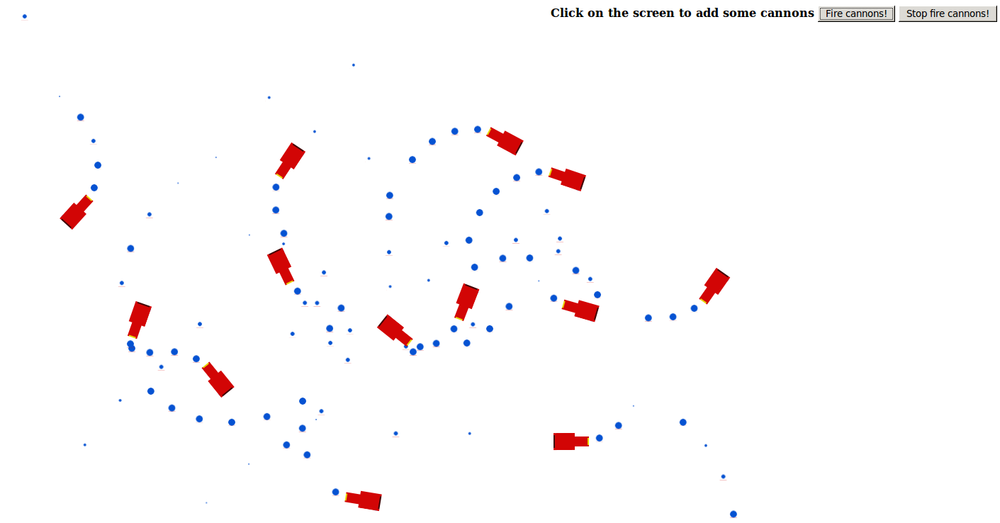

# Particles

Test project to implement a particle engine. When clicking on the
screen, some canons are added. When clicking on the "Fire canons"
button, the canon generate particles which are shot from them.

## Try it

Demo: http://padawin.github.io/particles/
